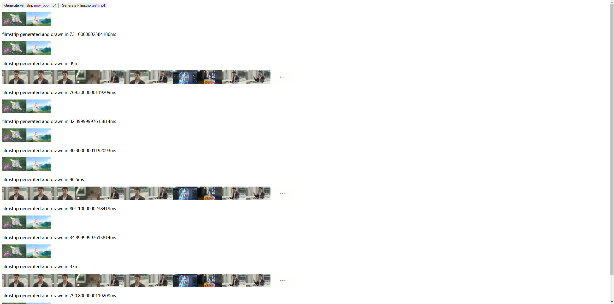

# Web Media Toolkit

## Introduction

- This is a toolkit for web media applications.
- Making media processing in the web easier.

## Setup

Install the dependencies:

```bash
pnpm install & cd .demo && pnpm install & wait
```

## Getting Started

Link the package to the demo:

```bash
cd .demo && pnpm link ../ && cd ..
```

Start the development server:

```bash
pnpm dev & cd .demo && pnpm dev & wait

```

## Screenshot


